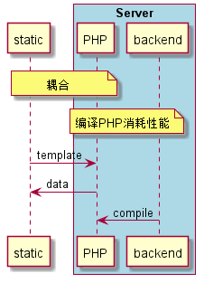
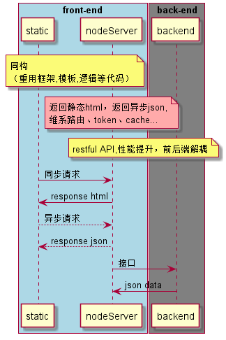

# 使用NODE作为中间件替代PHP层的实现方案

## 流程对比图:

###### 基于PHP的实现方式
------------

###### 基于nodeServer的实现方式
-------------
## node层代码实现
### 目前提供四块功能：server(日志、响应码、安全策略等)， route， HTML静态模板与JSON API， token缓存。

### 1. server
#### 由express framework 提供，该框架是node 层核心框架通过增加middleware完善功能，主要middleware有
* helmet：安全策略
* compression：request处理
* wrapRender：提供默认数据
* logger：日志服务
* bodyParser 预处理body
* cookieParser 预处理cookie

### 2. route
#### 由express提供，属于middleware的一种。按业务类型分三种
* 静态资源：直接返回对应目录下文件
* 需要动态组装的HTML：由模板引擎进行组装
* JSON：页面需要异步获取的信息等

### 3.HTML 模板
#### demo中使用ejs,为了达到同构效果，按照当前，使用vue.

### 4.token
#### 使用Memcached框架。